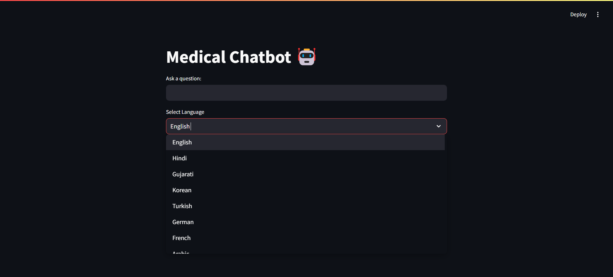
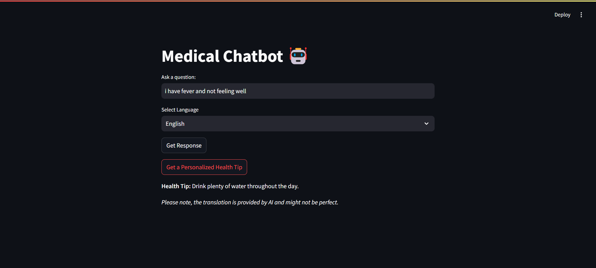
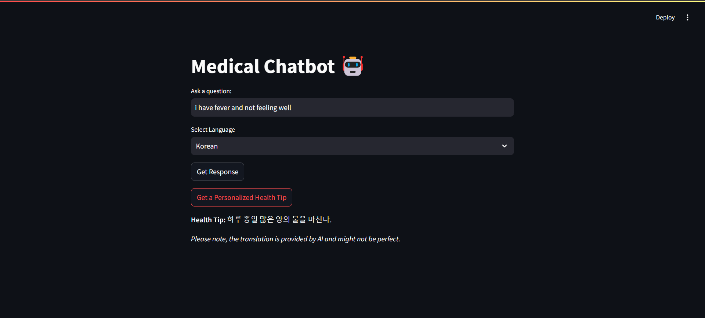

# AI-Health-Assistant
AI-powered Medical Chatbot 🤖 that provides health advice, disease-symptom analysis, and multilingual support using NLP and machine learning. It helps users receive personalized recommendations and health tips in multiple languages.

🚀 Features

Disease-Symptom-Cure Analysis:
Leverages a medical dataset to provide accurate analysis of symptoms, potential diseases, and recommended remedies.

Personalized Health Tips:
Offers tailored advice for better well-being based on user inputs and health queries.

Multilingual Support:
Supports multiple languages to ensure global accessibility and inclusivity.

AI-Based Response Generation:
Utilizes advanced NLP models (SentenceTransformer) to generate context-aware and reliable responses.

User-Friendly Interface:
Built with Streamlit, providing an intuitive and interactive web-based interface.

🛠️ Technologies Used

Natural Language Processing (NLP):
Powered by the SentenceTransformer model for medical-specific language understanding and response generation.

Machine Learning:
Uses PyTorch and Hugging Face Transformers for model inference and optimization.

Streamlit:
For building a seamless and interactive web-based interface.

Multilingual Support:
Enabled through deep-translator API for real-time language translation.

## 📸 Screenshots

### Main Screen
  
*The main interface of the Medical Chatbot.*

### Language Dropdown
  
*Dropdown menu showing supported languages.*

### Suggestions in English
  
*Example of health suggestions provided in English.*

### Suggestions in Gujarati
  
*Example of health suggestions provided in Gujarati.*

### Health Tip in English
  
*Example of a health tip provided in English.*

### Health Tip in Korean
  
*Example of a health tip provided in Korean.*

## 🛠️ Installation & Setup

### Prerequisites
- Python 3.11 or 3.12 (Python 3.13 has compatibility issues)
- Git installed on your system
- pip package manager

### Step-by-Step Installation

#### 1. Clone the Repository
```bash
git clone https://github.com/adibshaikh0313/AI-Health-Assistant.git
cd AI-Health-Assistant
GitHub Copilot
Here's the updated README.md with comprehensive installation and setup instructions for new users:

2. Install Required Dependencies
Option A: Install all dependencies at once
pip install streamlit transformers torch sentence-transformers deep-translator pandas scikit-learn tf-keras
Option B: Install from requirements file (if available)
pip install -r requirements.txt
Note: If you encounter errors with specific package versions, install the latest compatible versions as shown in Option A.

3. Fix Common Installation Issues
If you get tf-keras error:
pip install tf-keras
If you get PyTorch version error:
pip install torch torchvision torchaudio
If you get cgi module error (Python 3.13):
# Use deep-translator instead of googletrans
pip install deep-translator
4. Verify Dataset File
Make sure dataset - Sheet1.csv is in the project root directory. This file contains the medical database with diseases, symptoms, and cures.

🚀 Running the Application
Method 1: Using Python Module (Recommended)
python -m streamlit run chat.py
Method 2: Direct Streamlit Command
streamlit run chat.py
Note: If Method 2 doesn't work, add the Python Scripts folder to your PATH:
C:\Users\<YourUsername>\AppData\Roaming\Python\Python3XX\Scripts
🌐 Accessing the Application
Once the application starts, you'll see:
You can now view your Streamlit app in your browser.

  Local URL: http://localhost:8501
  Network URL: http://10.x.x.x:8501
  Local URL: Open this in your browser to use the app on your machine
Network URL: Share this with others on the same network to access your app
The application will automatically open in your default web browser.

📱 Using the Medical Chatbot
Enter Your Health Question: Type your symptoms or health query in the text input field
Select Language: Choose your preferred language from the dropdown menu (supports 13 languages)
Get Response: Click "Get Response" to receive medical suggestions based on the AI analysis
Get Health Tips: Click "Get a Personalized Health Tip" for general wellness advice
Supported Languages
English
Hindi
Gujarati
Korean
Turkish
German
French
Arabic
Urdu
Tamil
Telugu
Chinese
Japanese
🔧 Troubleshooting
Issue: streamlit command not found
Solution:

python -m streamlit run chat.py
Issue: ModuleNotFoundError for packages
Solution:
pip install <missing-package-name>
Issue: Keras/TensorFlow compatibility errors
Solution:
pip install tf-keras
pip uninstall keras
pip install keras==2.15.0
Issue: Translation errors
Solution: The app uses deep-translator which is more stable. Make sure it's installed:
pip install deep-translator
⚠️ Important Notes
Medical Disclaimer: This chatbot is for informational purposes only and should not replace professional medical advice. Always consult healthcare professionals for medical concerns.
Translation Accuracy: AI translations may not be perfect. For critical medical information, verify with professional translators.
Dataset Limitations: Responses are based on the included medical dataset. For conditions not in the database, consult a doctor.
🌍 Multilingual Support
Our chatbot is equipped with multilingual capabilities powered by deep-translator, allowing it to respond in various languages. Simply input your query, and the chatbot will provide an answer in the language of your choice with high accuracy.

🙏 Acknowledgments
SentenceTransformers: For providing the semantic similarity model
Hugging Face: For the Transformers library and model hosting
Streamlit: For the easy-to-use web framework
Deep Translator: For enabling multilingual support and accurate translations
PyTorch: For machine learning capabilities
👨‍💻 Developer
Adibmiya Shaikh: Lead Developer

📧 Support
For issues, questions, or contributions:

Open an issue on GitHub
Fork the repository and submit pull requests
📜 License
MIT License

Copyright (c) 2025

Permission is hereby granted, free of charge, to any person obtaining a copy of this software and associated documentation files (the "Software"), to deal in the Software without restriction, including without limitation the rights to use, copy, modify, merge, publish, distribute, sublicense, and/or sell copies of the Software, and to permit persons to whom the Software is furnished to do so, subject to the following conditions:

The above copyright notice and this permission notice shall be included in all copies or substantial portions of the Software.

THE SOFTWARE IS PROVIDED "AS IS", WITHOUT WARRANTY OF ANY KIND, EXPRESS OR IMPLIED, INCLUDING BUT NOT LIMITED TO THE WARRANTIES OF MERCHANTABILITY, FITNESS FOR A PARTICULAR PURPOSE AND NONINFRINGEMENT. IN NO EVENT SHALL THE AUTHORS OR COPYRIGHT HOLDERS BE LIABLE FOR ANY CLAIM, DAMAGES OR OTHER LIABILITY, WHETHER IN AN ACTION OF CONTRACT, TORT OR OTHERWISE, ARISING FROM, OUT OF OR IN CONNECTION WITH THE SOFTWARE OR THE USE OR OTHER DEALINGS IN THE SOFTWARE.

⭐ If you find this project helpful, please consider giving it a star on GitHub!

